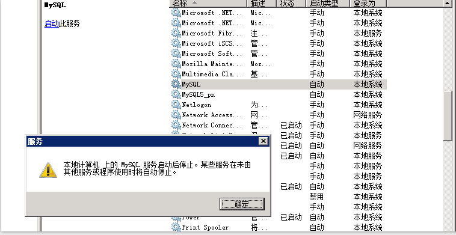

命令行启动服务报错：
E:\MySQL\mysql-5.7.31-winx64\bin>net start mysql
mysql 服务正在启动 .
mysql 服务无法启动。

服务没有报告任何错误。

请键入 NET HELPMSG 3534 以获得更多的帮助。


在Windows服务管理界面启动报错：
<!---->


使用mysqld --console 输出信息如下
```
E:\MySQL\mysql-5.7.31-winx64\bin>mysqld --console
2020-08-30T06:59:20.069934Z 0 [Warning] TIMESTAMP with implicit DEFAULT value is deprecated. Please use --explicit_defaults_for_timestamp server option (see documentation for more details).
2020-08-30T06:59:20.069998Z 0 [Note] --secure-file-priv is set to NULL. Operations related to importing and exporting data are disabled
2020-08-30T06:59:20.070479Z 0 [Note] mysqld (mysqld 5.7.31) starting as process 4204 ...
2020-08-30T06:59:20.075152Z 0 [Note] InnoDB: Mutexes and rw_locks use Windows interlocked functions
2020-08-30T06:59:20.076551Z 0 [Note] InnoDB: Uses event mutexes
2020-08-30T06:59:20.076669Z 0 [Note] InnoDB: _mm_lfence() and _mm_sfence() are used for memory barrier
2020-08-30T06:59:20.076833Z 0 [Note] InnoDB: Compressed tables use zlib 1.2.11
2020-08-30T06:59:20.077253Z 0 [Note] InnoDB: Number of pools: 1
2020-08-30T06:59:20.077454Z 0 [Note] InnoDB: Not using CPU crc32 instructions
2020-08-30T06:59:20.080331Z 0 [Note] InnoDB: Initializing buffer pool, total size = 128M, instances = 1, chunk size = 128M
2020-08-30T06:59:20.085867Z 0 [Note] InnoDB: Completed initialization of buffer pool
2020-08-30T06:59:20.110046Z 0 [Note] InnoDB: Highest supported file format is Barracuda.
2020-08-30T06:59:20.182408Z 0 [Note] InnoDB: Creating shared tablespace for temporary tables
2020-08-30T06:59:20.183340Z 0 [Note] InnoDB: Setting file '.\ibtmp1' size to 12 MB. Physically writing the file full; Please wait ...
2020-08-30T06:59:20.190682Z 0 [Note] InnoDB: File '.\ibtmp1' size is now 12 MB.
2020-08-30T06:59:20.192455Z 0 [Note] InnoDB: 96 redo rollback segment(s) found. 96 redo rollback segment(s) are active.
2020-08-30T06:59:20.193622Z 0 [Note] InnoDB: 32 non-redo rollback segment(s) are active.
2020-08-30T06:59:20.194108Z 0 [Note] InnoDB: Waiting for purge to start
2020-08-30T06:59:20.255092Z 0 [Note] InnoDB: 5.7.31 started; log sequence number 2760554
2020-08-30T06:59:20.256016Z 0 [Note] Plugin 'FEDERATED' is disabled.
2020-08-30T06:59:20.256961Z 0 [Note] InnoDB: Loading buffer pool(s) from E:\MySQL\mysql-5.7.31-winx64\data\ib_buffer_pool
2020-08-30T06:59:20.260165Z 0 [ERROR] unknown variable 'Interactive_timeout=1814400'
2020-08-30T06:59:20.260524Z 0 [ERROR] Aborting

2020-08-30T06:59:20.260856Z 0 [Note] Binlog end
2020-08-30T06:59:20.261205Z 0 [Note] Shutting down plugin 'ngram'
2020-08-30T06:59:20.261442Z 0 [Note] Shutting down plugin 'partition'
2020-08-30T06:59:20.261752Z 0 [Note] Shutting down plugin 'BLACKHOLE'
2020-08-30T06:59:20.262081Z 0 [Note] Shutting down plugin 'ARCHIVE'
2020-08-30T06:59:20.262359Z 0 [Note] Shutting down plugin 'PERFORMANCE_SCHEMA'
2020-08-30T06:59:20.262657Z 0 [Note] Shutting down plugin 'MRG_MYISAM'
2020-08-30T06:59:20.262860Z 0 [Note] Shutting down plugin 'MyISAM'
2020-08-30T06:59:20.263069Z 0 [Note] Shutting down plugin 'INNODB_SYS_VIRTUAL'
2020-08-30T06:59:20.263210Z 0 [Note] Shutting down plugin 'INNODB_SYS_DATAFILES'
2020-08-30T06:59:20.263381Z 0 [Note] Shutting down plugin 'INNODB_SYS_TABLESPACES'
2020-08-30T06:59:20.263563Z 0 [Note] Shutting down plugin 'INNODB_SYS_FOREIGN_COLS'
2020-08-30T06:59:20.263825Z 0 [Note] Shutting down plugin 'INNODB_SYS_FOREIGN'
2020-08-30T06:59:20.263980Z 0 [Note] Shutting down plugin 'INNODB_SYS_FIELDS'
2020-08-30T06:59:20.264152Z 0 [Note] Shutting down plugin 'INNODB_SYS_COLUMNS'
2020-08-30T06:59:20.264363Z 0 [Note] Shutting down plugin 'INNODB_SYS_INDEXES'
2020-08-30T06:59:20.264504Z 0 [Note] Shutting down plugin 'INNODB_SYS_TABLESTATS'
2020-08-30T06:59:20.264720Z 0 [Note] Shutting down plugin 'INNODB_SYS_TABLES'
2020-08-30T06:59:20.264873Z 0 [Note] Shutting down plugin 'INNODB_FT_INDEX_TABLE'
2020-08-30T06:59:20.265068Z 0 [Note] Shutting down plugin 'INNODB_FT_INDEX_CACHE'
2020-08-30T06:59:20.265241Z 0 [Note] Shutting down plugin 'INNODB_FT_CONFIG'
2020-08-30T06:59:20.265412Z 0 [Note] Shutting down plugin 'INNODB_FT_BEING_DELETED'
2020-08-30T06:59:20.265582Z 0 [Note] Shutting down plugin 'INNODB_FT_DELETED'
2020-08-30T06:59:20.265752Z 0 [Note] Shutting down plugin 'INNODB_FT_DEFAULT_STOPWORD'
2020-08-30T06:59:20.265924Z 0 [Note] Shutting down plugin 'INNODB_METRICS'
2020-08-30T06:59:20.266094Z 0 [Note] Shutting down plugin 'INNODB_TEMP_TABLE_INFO'
2020-08-30T06:59:20.266275Z 0 [Note] Shutting down plugin 'INNODB_BUFFER_POOL_STATS'
2020-08-30T06:59:20.266435Z 0 [Note] Shutting down plugin 'INNODB_BUFFER_PAGE_LRU'
2020-08-30T06:59:20.266607Z 0 [Note] Shutting down plugin 'INNODB_BUFFER_PAGE'
2020-08-30T06:59:20.266780Z 0 [Note] Shutting down plugin 'INNODB_CMP_PER_INDEX_RESET'
2020-08-30T06:59:20.266996Z 0 [Note] Shutting down plugin 'INNODB_CMP_PER_INDEX'
2020-08-30T06:59:20.267167Z 0 [Note] Shutting down plugin 'INNODB_CMPMEM_RESET'
2020-08-30T06:59:20.267342Z 0 [Note] Shutting down plugin 'INNODB_CMPMEM'
2020-08-30T06:59:20.267511Z 0 [Note] Shutting down plugin 'INNODB_CMP_RESET'
2020-08-30T06:59:20.267682Z 0 [Note] Shutting down plugin 'INNODB_CMP'
2020-08-30T06:59:20.267870Z 0 [Note] Shutting down plugin 'INNODB_LOCK_WAITS'
2020-08-30T06:59:20.268065Z 0 [Note] Shutting down plugin 'INNODB_LOCKS'
2020-08-30T06:59:20.268258Z 0 [Note] Shutting down plugin 'INNODB_TRX'
2020-08-30T06:59:20.268411Z 0 [Note] Shutting down plugin 'InnoDB'
2020-08-30T06:59:20.268604Z 0 [Note] InnoDB: FTS optimize thread exiting.
2020-08-30T06:59:20.268770Z 0 [Note] InnoDB: Starting shutdown...
2020-08-30T06:59:20.268975Z 0 [Note] InnoDB: Buffer pool(s) load completed at 200830 14:59:20
2020-08-30T06:59:20.269259Z 0 [Note] InnoDB: Dumping buffer pool(s) to E:\MySQL\mysql-5.7.31-winx64\data\ib_buffer_pool
2020-08-30T06:59:20.270691Z 0 [Note] InnoDB: Buffer pool(s) dump completed at 200830 14:59:20
2020-08-30T06:59:21.695875Z 0 [Note] InnoDB: Shutdown completed; log sequence number 2760573
2020-08-30T06:59:21.696615Z 0 [Note] InnoDB: Removed temporary tablespace data file: "ibtmp1"
2020-08-30T06:59:21.697163Z 0 [Note] Shutting down plugin 'MEMORY'
2020-08-30T06:59:21.697422Z 0 [Note] Shutting down plugin 'CSV'
2020-08-30T06:59:21.697813Z 0 [Note] Shutting down plugin 'sha256_password'
2020-08-30T06:59:21.698081Z 0 [Note] Shutting down plugin 'mysql_native_password'
2020-08-30T06:59:21.698454Z 0 [Note] Shutting down plugin 'binlog'
2020-08-30T06:59:21.698917Z 0 [Note] mysqld: Shutdown complete
```

发现输出信息中有ERROR的地方，在my.ini中找到对应的配置，修改即可