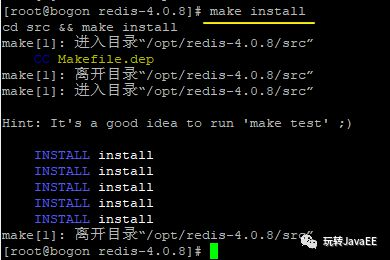

### Linux上安装Redis
hello，各位小伙伴们好久不见！那么从今天开始，我想和各位小伙伴分享下Redis的用法，本文我们就先来看看什么是Redis以及如何安装Redis。
#### 什么是Redis
Redis是一个使用ANSI C编写的开源、支持网络、基于内存、可选持久性的键值对存储数据库。从2015年6月开始，Redis的开发由Redis Labs赞助，而2013年5月至2015年6月期间，其开发由Pivotal赞助。在2013年5月之前，其开发由VMware赞助。根据月度排行网站DB-Engines.com的数据显示，Redis是最流行的键值对存储数据库。
#### Redis具有如下特点：
>1. Redis支持数据的持久化，可以将内存中的数据保持在磁盘中，重启的时候可以再次加载进行使用，不会造成数据丢失
>2. Redis支持五种不同的数据结构类型之间的映射，包括简单的key/value类型的数据，同时还提供list，set，zset，hash等数据结构的存储
>3. Redis支持master-slave模式的数据备份
#### Redis具有如下功能：
>1. 内存存储和持久化：redis支持异步将内存中的数据写到硬盘上，在持久化的同时不影响继续服务
>2. 取最新N个数据的操作，如：可以将最新的10条评论的ID放在Redis的List集合里面
>3. 数据可以设置过期时间
>4. 自带发布、订阅消息系统
>5. 定时器、计数器
#### Redis安装
> Windows版Redis的安装，整体来说还是非常简单的，网上也有很多教程，考虑到Redis的大部分使用场景都是在Linux上，因此这里我对Windows上的安装不做介绍，小伙伴们有兴趣可以自行搜索，下面我们主要来看下Linux上怎么安装Redis。  
> **环境：**  
> CentOS7  
> redis4.0.8   
> 1. 首先下载Redis，下载地址https://redis.io/，下载获得redis-4.0.8.tar.gz后将它放入我们的Linux目录/opt  
> <!-- -->
> 
> 2. /opt目录下，对文件进行解压，解压命令:tar -zxvf redis-4.0.8.tar.gz，如下：  
> <!-- --> 
> 
> 3. 解压完成后出现文件夹：redis-4.0.8，进入到该目录中:cd redis-4.0.8  
> <!--  -->
> 
> 4. 在redis-4.0.8目录下执行make命令进行编译  
> <!-- -->
> 
> 5. 如果make完成后继续执行make install进行安装。OK，至此，我们的redis就算安装成功了。  
> <!-- -->
> 
> 6. 在我们启动之前，需要先做一个简单的配置：修改redis.conf文件，将里面的daemonize no 改成 yes，让服务在后台启动，如下：  
> <!--  --> 
> 
> <!-- -->
> 
> 7. 启动，通过`redis-server redis.conf`命令启动redis，如下：  
> <!-- -->
> 
> 8. 测试。首先我们可以通过`redis-cli`命令进入到控制台，然后通过`ping`命令进行连通性测试，如果看到pong，表示连接成功了，如下：  
> <!-- -->
> 
> 9. 关闭，通过`shutdown`命令我们可以关闭实例，如下：  
> <!-- -->
> 

OK，至此，我们的Redis就安装成功了。

